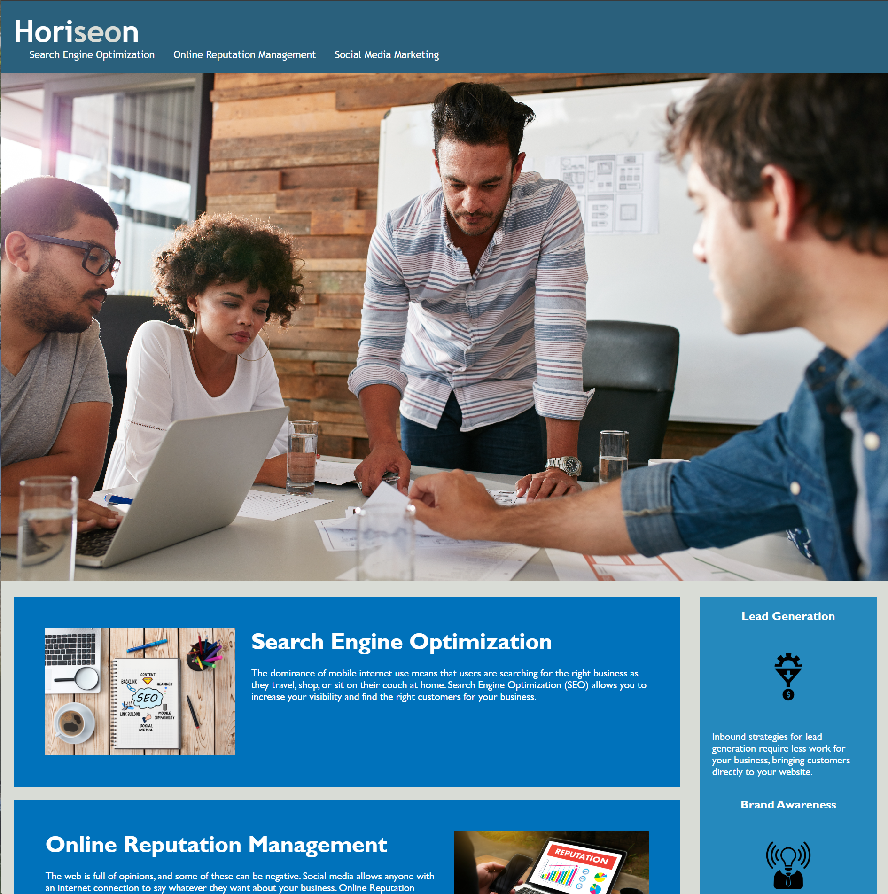

# SEO-Marketing-Webpage

## Description

My motivation for this project was to update a preexisting webpage to be inline with current accessability standards.
This webpage solves any accessibility issues for users who are unable to view a .jpg file and has been updated to include alt text to explain what the webpage is displaying.
I learned that it is easier said than done to update non-semantic HTML to semantic HTML.

## Screenshot of Webpage

  

## Usage

You are able to utilize this webpage to learn about topics surrounding Search Engine optimization. These topics include Online Reputation Management, Social Media Marketing, Lead Generation, Brand Awareness, and Cost Management.

## License

MIT

